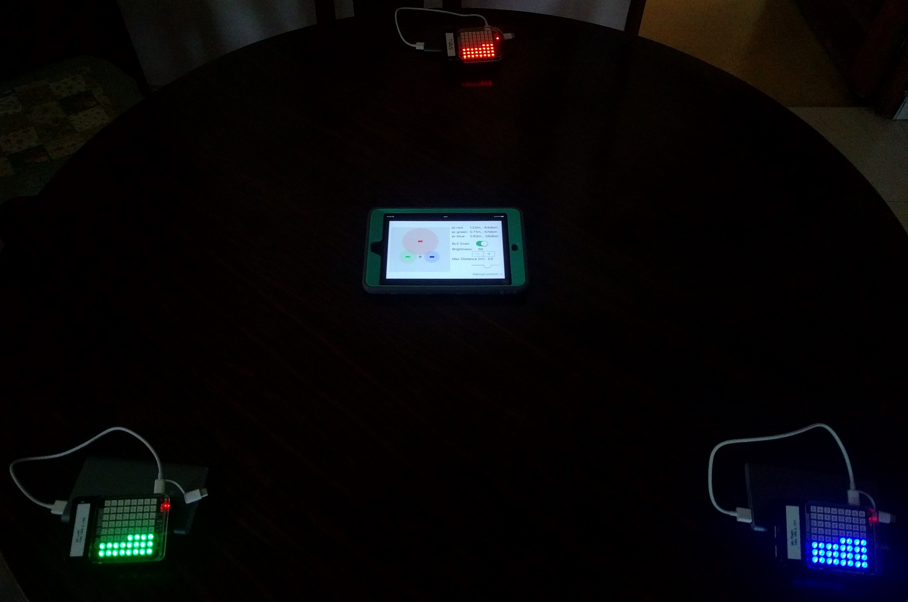
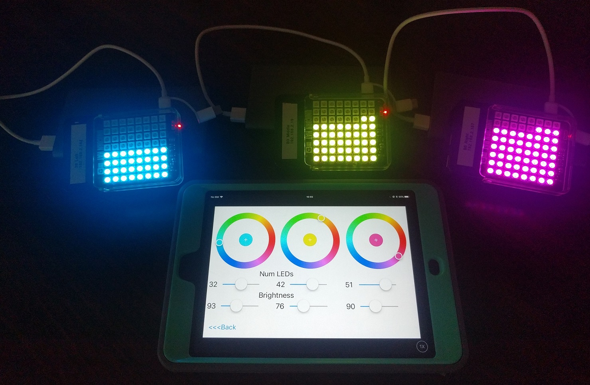

# ble-localiser

 This talk is about how I manage to do localisation using 3 Raspberry Pis(RPis) as beacons. Each RPi is also equipped with a 8x8 RGB LED grid that is controlled via the iPad. This was given at both iOS Dev Scout and iOS Conf SG 2017.

## Media





1. Overview at iOSConfSG: [Slides](https://www.slideshare.net/yeokm1/ble-localiser-for-ios-conf-sg-2017-80803648), [Video](https://engineers.sg/v/2056)
2. Full talk at iOSDevScout: [Slides](https://www.slideshare.net/yeokm1/ble-localiser-full-for-ios-dev-scout)

## Setup Instructions for Raspberry Pi

1) Download [Raspbian Stretch Lite](https://www.raspberrypi.org/downloads/raspbian/) and burn to SD card.

2) Connect RPi to LAN, HDMI to screen and boot from SD card

3) Fully update Pi

```bash
sudo apt update
sudo apt upgrade
sudo reboot
```

4) Configure settings

`sudo raspi-config`

Change all relevant settings but the most important is to enlarge file system and enable SSH. Change password if you need to.

You might want to add `enable_uart=1` into `/boot/config.txt`. It has an added side effect of capping the CPU frequency to the minimum.

5)

```
sudo apt install git python-pip python-dev libpython2.7 clang
git clone https://github.com/yeokm1/ble-localiser
```

6) Follow instructions to setup for [pi-led-changer](pi-led-changer/README.md)

7) Follow instructions to setup for [pi-broadcaster](pi-broadcaster/README.md)

8) Make programs start on boot:

On RPi:
```bash
cd ~/ble-localiser
chmod +x starter.sh
sudo mv starter.service /etc/systemd/system/
sudo systemctl enable starter.service
```

8) `reboot`
